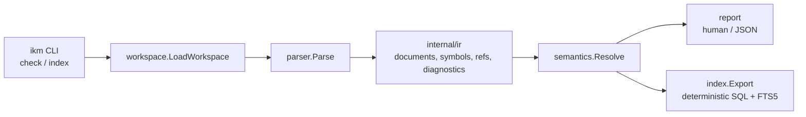
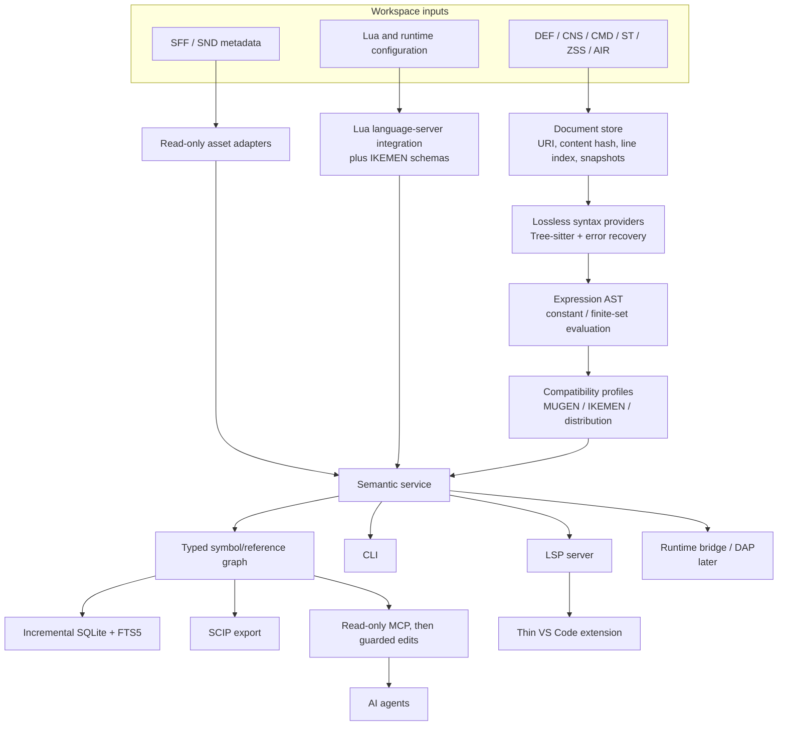

# IKEMEN Devtools: MVP Deep Dive and Product Evolution

Date: 2026-07-29
Review target: current on-disk snapshot of `_upstream/ikemen-devtools`
Review type: architecture, correctness, product readiness, and roadmap

## Summary

**State: MVP validated; product foundation not yet stable.**

The MVP is a credible bootstrap, not a throwaway. It has a small Go core, clear package seams, deterministic diagnostics and SQL, strong local tests, and no runtime dependency on IKEMEN. All unit tests, `go vet`, formatting checks, the race detector, and a clean CLI build pass.

The default next move should be **a compatibility-and-contract stabilization release**, not LSP, MCP, or a graphical IDE. Real-corpus testing found two authority blockers:

1. The workspace resolver strips the leading `=/` path component, but 380 of 416 character DEF files in this distribution use that convention and the referenced assets physically live under `=` directories.
2. Semantic resolution can classify references as ambiguous without emitting diagnostics. A real character returned exit code 0 while its SQL index contained four ambiguous references.

Those are not cosmetic defects. LSP hover, go-to-definition, rename, graphs, and agent tools would all amplify them.

**Recommendation:** retain the Go architecture and package boundaries, replace the line scanner with a lossless syntax layer behind an interface, make compatibility profiles explicit, separate stable semantic keys from source occurrences, and build one shared semantic service before adding protocol adapters.

### TL;DR

- **Keep:** Go, deterministic outputs, narrow package seams, CLI-first delivery, SQLite/FTS as the exact index.
- **Fix first:** corpus fidelity, path semantics, ambiguity handling, contract versioning, stable identity, lossless syntax, and security boundaries.
- **Build next:** compatibility oracle → lossless CST and expression AST → incremental semantic service → SQLite store → LSP/VS Code → read-only MCP/SCIP → safe edits → wider file ecosystem → DAP/runtime bridge.
- **Do not build yet:** MCP write tools, rename, a rich IDE, or DAP on top of the current semantic model.

## 1. What the MVP Actually Delivers

The current data flow is:



### Implemented

| Capability | State | Notes |
|---|---:|---|
| Go semantic core | Good MVP | Seven focused packages with no third-party dependency |
| DEF/CNS/CMD/ST structural parsing | Partial | Tolerant INI-like line scanner |
| Source spans and recoverable diagnostics | Partial | One-based line/column ranges; not a lossless CST |
| Character workspace loading | Partial | Root DEF plus selected `[Files]` keys |
| State and command symbols | Partial | Definitions and direct references |
| Resolution classifications | Partial | exact, ambiguous, invalid, dynamic |
| Deterministic reporting | Good MVP | Human and JSON output are sorted |
| Deterministic SQLite export | Good MVP | Executable SQL with ordinary and FTS5 tables |
| CLI | Minimal | `check` and `index` |
| Package seam tests | Good MVP | Test LOC is slightly higher than production LOC |

### Explicitly absent

- Expression parsing and evaluation
- Compatibility profiles
- Lossless or incremental parsing
- Stable edit-resistant symbol identity
- Live/incremental SQLite database
- Workspace-wide game model
- LSP, MCP, SCIP, VS Code extension, or DAP
- ZSS, AIR, SFF, SND, motif, stage, select, and Lua-aware analysis
- Corpus/differential tests against IKEMEN behavior
- CI, release automation, license, changelog, signed binaries, or installer

This places the implementation at a **bootstrap semantic vertical slice**. It does not yet complete the original first milestone because source discovery and semantic authority are not reliable across the supplied corpus.

## 2. Engineering Evidence

### Repository size

- 7 production Go files: 2,372 lines
- 7 test Go files: 2,477 lines
- No third-party Go dependency
- No Git metadata in the reviewed directory, so this is a snapshot review rather than a commit-diff review
- No fixture/golden corpus, CI configuration, release configuration, or license file

### Checks run

| Check | Result |
|---|---:|
| `go test ./... -count=1` | Pass |
| `go vet ./...` | Pass |
| `gofmt -l .` | Pass; no files listed |
| `go test -race ./... -count=1` | Pass |
| `go build -trimpath ./cmd/ikm` | Pass |

Statement coverage:

| Package | Coverage |
|---|---:|
| `cmd/ikm` | 71.6% |
| `internal/index` | 71.7% |
| `internal/ir` | 0.0% |
| `internal/parser` | 79.6% |
| `internal/report` | 77.8% |
| `internal/semantics` | 76.4% |
| `internal/workspace` | 83.3% |

The behavioral coverage is healthy for an MVP. The missing piece is diversity: tests are synthetic package-seam tests rather than a compatibility corpus.

### Real-corpus results

A deterministic sample of 30 likely primary character DEFs produced:

- 2 passing checks
- 28 failing checks
- 57 errors and 84 warnings
- 10 ms median process time
- 54 `missing-source` errors
- 84 `dynamic-reference` warnings
- 3 `duplicate-definition` errors

This sample is intentionally small and alphabetically biased. It is evidence of a systematic resolver mismatch, not a quality score for the whole repository.

The named Sasuke package produced:

- exit code 1
- 44 diagnostics
- 8 errors
- 36 warnings
- 6 authored `[state ]` sections reported as missing state IDs
- 2 unresolved numeric state references

The empty `[state ]` sections are authored input and may be tolerated by the runtime. Their severity therefore belongs in a compatibility profile rather than a universal parser rule.

### SQL execution evidence

For `Boros V2 OP`:

- `ikm index --output` exited 0
- generated SQL size: 1,692,632 bytes
- SQLite loaded it successfully
- 8 documents
- 1,868 symbols
- 336 references
- 28 diagnostics
- reference classifications: 304 exact, 28 dynamic, 4 ambiguous

This proves that the SQL is executable and deterministic enough for an MVP. It also proves that a successful `check` can conceal semantic ambiguity.

### Ecosystem scale in this distribution

| Type | Files | Approximate size |
|---|---:|---:|
| DEF | 544 | 1.45 MiB |
| CNS | 512 | 77.18 MiB |
| CMD | 405 | 137.93 MiB |
| ST | 5 | 0.11 MiB |
| ZSS | 30 | 0.28 MiB |
| AIR | 407 | 51.03 MiB |
| SFF | 527 | 15,157.72 MiB |
| SND | 403 | 7,430.43 MiB |
| Lua | 102 | 1.76 MiB |

There are 2,011 relevant text files totaling about 269.75 MiB. At least 502 CNS/ST files contain expression-like state values. This is why a real expression model and incremental invalidation are product requirements, not optional polish.

## 3. Findings

### P0 — The resolver changes real path meaning

`internal/workspace/workspace.go:146-180` strips a leading `=` and then leading separators. A test at `internal/workspace/workspace_test.go:11-66` explicitly expects `=/hero.cmd` to resolve to `hero.cmd`.

That assumption contradicts the supplied distribution:

- 380 of 416 character DEF files contain leading-equals text-source paths.
- `chars/Abigail/Abigail.def` declares `cmd = =/cmd.cmd` and `cns = =/main.cns`.
- The actual files are `chars/Abigail/=/cmd.cmd` and `chars/Abigail/=/main.cns`.

**Impact:** most sampled characters lose their state and command documents before parsing. Every downstream symbol, reference, diagnostic, index, hover, and graph becomes incomplete.

**Decision:** path interpretation must be owned by a named compatibility profile. For this distribution, `=` is a literal path component. Validate other profiles against IKEMEN/MUGEN behavior instead of normalizing by intuition.

### P0 — Ambiguity is silently accepted

`internal/semantics/semantics.go:190-193` and `:218-221` record ambiguous state/command references but emit no diagnostic. `cmd/ikm` only fails on diagnostics with error severity.

Observed result: `Boros V2 OP` returns exit code 0 while its index contains four ambiguous references.

**Impact:** go-to-definition can pick the wrong target, rename can edit the wrong declaration, and an agent can report false certainty.

**Decision:** every non-exact resolution must have an explicit, profile-aware outcome visible to clients. Ambiguity may be allowed by a runtime precedence rule, but then the resolved winner and candidate set must be recorded. Otherwise it must produce a diagnostic.

### P1 — “Stable” identities change on ordinary edits

`internal/parser/parser.go:581-605` builds symbol and reference IDs from kind, line number, and path. Workspace loading supplies absolute paths. Adding one comment above a symbol changes its ID; moving a checkout changes every ID. State IDs also contain duplicated prefixes such as `state:state:100:...`.

**Impact:** database churn, broken cross-session graph links, noisy agent diffs, unstable caches, and fragile LSP rename/reference behavior.

**Decision:** separate three concepts:

1. **Semantic key:** workspace namespace + symbol kind + canonical name.
2. **Occurrence identity:** document URI + syntax anchor/fingerprint + local ordinal.
3. **Store identity:** database surrogate key scoped to an index generation.

Line and column are locations, not identity.

### P1 — The IR claims 1.0 stability before the semantics are ready

`internal/ir/types.go:3` declares version `1.0.0`. A reference has a Boolean `IsDynamic`, while richer resolution data is stored separately in `internal/semantics`. There is no candidate set, finite target set, profile, namespace, content hash, byte offset, URI, or edit anchor.

**Impact:** protocol adapters will either leak internal types or invent incompatible side contracts.

**Decision:** move the external contract back to `0.x` until one LSP and one MCP consumer have proven it. Keep the internal model evolvable. Publish separate versioned DTOs under a protocol boundary; do not make one struct graph serve parser internals, storage, LSP, and MCP forever.

### P1 — The parser is tolerant but neither lossless nor incremental

`internal/parser/parser.go:17` splits the complete source into lines. It drops blank lines from the IR, drops pre-section comments, and does not retain inline comments when a code line is parsed. Sections only retain a header span. Expressions are treated as strings.

**Impact:** safe formatting-preserving edits, structural rename, precise hover, and incremental re-analysis cannot be built reliably on this representation.

**Decision:** introduce a lossless concrete syntax tree (CST) with error nodes and trivia. The recommended path remains Tree-sitter for structural grammars plus a dedicated expression AST/evaluator. Put it behind a syntax-provider interface so the current scanner can be replaced package by package, then delete the scanner instead of maintaining two permanent parsers.

### P1 — The index is an export, not the product’s working index

`internal/index/index.go:36-60` creates schema and inserts every row. `:134-144` deletes all base and FTS rows on every load.

Strengths:

- deterministic ordering
- SQL escaping
- transaction boundary
- ordinary and FTS5 tables
- portable CLI handoff

Missing product properties:

- incremental updates and invalidation
- schema migrations
- workspace/profile identity
- content hashes and index generations
- foreign keys and candidate edges
- crash recovery and concurrency policy
- query API and performance budgets
- workspace-relative portable paths

**Decision:** keep SQL export as a debugging/interchange feature. Add an embedded live SQLite store behind a repository interface for LSP/MCP/CLI use.

### P1 — Agent use needs a hard filesystem boundary

The loader accepts absolute and UNC paths and reads them directly. That is acceptable for a trusted local CLI. It is not acceptable as the default for an agent server.

**Decision:** the future service must take an explicit workspace root and capability policy. Reads outside the root require opt-in. MCP starts read-only. Mutating tools return reviewed patches with content-hash preconditions.

### P2 — The CLI contract is incomplete and misleading

`cmd/ikm/main.go:236-238` prints only:

```text
usage: ikm check [--json] <path>
```

The same text is printed for `index --help`, unknown commands, and missing index arguments. `--help` exits 1. There is no `version`, compatibility profile, root, severity threshold, quiet mode, SARIF, or machine-readable index metadata.

**Decision:** fix this during stabilization, but after correctness. Use distinct exit codes for usage failure, completed-with-findings, and internal failure.

### P2 — Some package APIs are broader than their depth warrants

`internal/report/report.go:18-140` contains many aliases for the same operations (`NewFrom...`, `From...`, `...Result`, JSON helpers, and human helpers).

**Impact:** shallow convenience APIs become compatibility surface before there are real external consumers.

**Decision:** reduce the report package to one constructor, one normalized report type, and explicit encoders. Let adapters own their presentation conveniences.

### P2 — Product operations are absent

There is no repository license, CI, fuzzing, benchmark suite, release metadata, version command, changelog, support matrix, installer, code signing, SBOM, or update policy.

This is normal for an MVP. It becomes a release blocker at public alpha.

## 4. Architecture Decision

### Keep the modular shape; deepen the core

The current package flow has good locality. The parser, workspace, semantics, reporting, and index responsibilities are understandable. The evolution should preserve those seams while changing their contracts.

The target architecture:



### Core module contracts

| Module | Deep responsibility | Must not own |
|---|---|---|
| Document store | snapshots, content hashes, URI normalization, line/UTF-16 mapping | language semantics |
| Syntax provider | lossless CST, errors, incremental parse | workspace resolution |
| Expression engine | AST, constant/finite evaluation, dynamic classification | UI formatting |
| Compatibility profile | path rules, fallback order, case behavior, runtime tolerance | parsing mechanics |
| Workspace model | roots, namespaces, dependency graph, invalidation | protocol transport |
| Semantic service | symbols, scopes, references, candidates, diagnostics, safe edits | SQLite syntax |
| Store | transactions, migrations, exact/FTS queries, generations | semantic inference |
| Adapters | CLI/LSP/MCP/SCIP/DAP protocol mapping | duplicated parsing |

### Resolution contract

Replace the Boolean dynamic flag with a closed result:

```text
Exact(target)
Finite(candidates, selected-by-profile?)
Ambiguous(candidates)
Dynamic(expression, known-constraints?)
Invalid(reason)
```

Every result carries:

- source occurrence
- semantic target key
- candidate set
- compatibility profile
- evidence/source span
- confidence is never substituted for exactness

### Reversibility

The expensive one-way decisions are the external protocol DTOs, symbol identity, compatibility semantics, and database migration policy. Stabilize those deliberately.

Tree-sitter implementation details, SQLite driver choice, extension UI framework, and packaging tooling are two-way decisions when hidden behind the interfaces above. Spike them quickly and keep exit ramps.

## 5. The Governing Constraint

The present constraint is **semantic trust against real content**.

Applying the five focusing steps:

1. **Identify:** real paths and ambiguous targets are misrepresented before consumers see them.
2. **Exploit:** use the existing distribution as a corpus; turn every observed convention into a profile fixture.
3. **Subordinate:** delay LSP/MCP/UI work; improve the shared semantic core and corpus oracle.
4. **Elevate:** add lossless parsing, expression analysis, and differential IKEMEN checks.
5. **Repeat:** once fidelity gates pass, the constraint will likely move to incremental latency, then product UX.

Adding adapters now would increase work in progress and multiply contract migrations.

## 6. Roadmap With Exit Gates

Effort bands assume one experienced engineer. Parallel work is safe only after the stabilization contracts land.

### Milestone 0 — Stabilization and compatibility oracle

**Goal:** make current answers trustworthy before expanding the surface.
**Indicative effort:** 2–4 weeks.

1. Add repository metadata: license decision, CI, version command, changelog, contribution and release policy.
2. Define compatibility-profile and workspace-root contracts.
3. Build an active-roster corpus manifest from `data/select.def`, plus curated edge fixtures.
4. Add a differential oracle against IKEMEN’s loader/parser behavior where possible.
5. Fix leading-equals path handling under the correct profile.
6. Add `cns` as a first-class `[Files]` source key even though this distribution redundantly declares `st`.
7. Make ambiguous and precedence-selected results visible.
8. Change the external IR to `0.x`; document compatibility rules.
9. Replace line-based IDs with semantic keys and occurrence IDs.
10. Fix CLI help, subcommand usage, and exit-code taxonomy.

**Exit gate:**

- 100% of active roster manifests complete without a crash.
- At least 99% of declared text sources resolve under their selected profile.
- Every unresolved source includes attempted candidates and profile evidence.
- No known false-positive error remains in the curated corpus.
- No silent ambiguous/invalid resolution.
- Unit, corpus, race, vet, formatting, and short fuzz gates run in CI.

### Milestone 1 — Semantic core alpha

**Goal:** finish the real vertical slice from source text to trustworthy graph.
**Indicative effort:** 6–10 weeks.

1. Introduce a `SyntaxProvider` interface.
2. Implement lossless Tree-sitter grammars for DEF/CNS/CMD/ST structure.
3. Implement a dedicated trigger/value expression parser.
4. Evaluate constants and finite target sets without guessing dynamic values.
5. Model state scopes, command scopes, file load order, common states, overrides, and profile precedence.
6. Preserve syntax trivia and produce guarded text edits.
7. Add fuzzing, malformed-file recovery tests, golden CST tests, and differential corpus tests.
8. Remove the old scanner after parity; do not leave a permanent dual-parser architecture.

**Exit gate:**

- Exact, finite, ambiguous, dynamic, and invalid results are distinct.
- Safe round-trip edits preserve unrelated bytes.
- Parser never panics on the full text corpus or fuzz corpus.
- Profile results match the runtime oracle for the agreed vertical slice.
- A one-line edit invalidates only its document and dependent semantic nodes.

### Milestone 2 — Incremental platform and exact store

**Goal:** create the one service all adapters use.
**Indicative effort:** 4–7 weeks.

1. Add document snapshots, content hashes, change sets, and cancellation.
2. Add dependency-based invalidation and bounded concurrency.
3. Replace full-refresh working state with an embedded SQLite repository.
4. Add schema migrations, workspace/index generations, foreign keys, and integrity checks.
5. Keep deterministic SQL export for inspection and interchange.
6. Add benchmark and memory baselines for this 269.75 MiB text corpus.

**Initial performance budgets:**

- warm go-to/hover query: p95 under 50 ms
- incremental diagnostics for a typical edit: p95 under 100 ms
- large-file incremental diagnostics: p95 under 250 ms
- cancellation observed within 50 ms
- no full-workspace reparse for a local edit

Budgets should be adjusted from recorded hardware baselines, not weakened silently.

### Milestone 3 — LSP and thin VS Code beta

**Goal:** prove the semantic service through an established IDE protocol.
**Indicative effort:** 5–8 weeks.

Deliver in this order:

1. diagnostics
2. document/workspace symbols
3. hover
4. go-to-definition
5. find references
6. completion
7. semantic tokens
8. code actions
9. guarded rename only for exact references

The VS Code extension should launch/configure the server, expose profiles, and add small domain views. It must not duplicate parser or graph logic.

**Exit gate:**

- Results are identical between CLI and LSP for the same snapshot/profile.
- Multi-root workspaces and cancellation work.
- Rename refuses dynamic or ambiguous references.
- Extension install, upgrade, logs, crash recovery, and offline use are documented.

### Milestone 4 — Agent-first MCP and interoperability

**Goal:** give agents bounded, exact, explainable tools.
**Indicative effort:** 4–7 weeks.

Start read-only:

- workspace summary
- symbol at location
- definition and candidate lookup
- exact references
- dependency/impact graph
- diagnostics by code/severity/profile
- explain resolution
- bounded search over exact and FTS indexes
- SCIP export

Then add guarded mutations:

- preview edits
- apply patch with snapshot/content-hash precondition
- rollback artifact
- re-run affected diagnostics

**Security and reliability gate:**

- workspace-root containment by default
- explicit permission for external paths
- bounded rows, bytes, time, and graph depth
- no secrets or binary payloads in model-facing output
- every answer carries path, span, profile, index generation, and resolution class
- mutation is disabled by default and never guesses through ambiguity

### Milestone 5 — Full authored-file ecosystem

**Goal:** extend the graph without destabilizing the core.
**Indicative effort:** 3–6 months, delivered in slices.

Recommended order:

1. select/system/stage/character DEF families
2. AIR action and sprite references
3. read-only SFF/SND metadata and validation
4. ZSS
5. motif and screenpack relationships
6. Lua integration through `lua-language-server` plus IKEMEN-specific schemas/adapters
7. asset previews and Fighter Factory handoff

Do not build a replacement binary asset editor first. Preserve Fighter Factory as the specialist visual tool while this product owns semantics, navigation, validation, automation, and cross-file graphs.

### Milestone 6 — Runtime bridge and DAP

**Goal:** connect authored semantics to live IKEMEN execution.
**Indicative effort:** depends on upstream engine hooks.

Potential capabilities:

- current state/controller and transition trace
- trigger and expression values
- variable watches
- breakpoints on states/controllers
- runtime-to-source mapping
- safe hot reload for an explicitly supported subset

This requires an upstream protocol and should not be faked through log scraping as the permanent design.

### Milestone 7 — Product 1.0

Release only after:

- published compatibility matrix and deprecation policy
- stable protocol DTO and SQLite migration policy
- signed Windows binaries and extension
- reproducible releases, SBOM, vulnerability scanning, and checksums
- crash diagnostics with opt-in telemetry
- onboarding tutorial and sample workspace
- troubleshooting and recovery documentation
- tested upgrade/downgrade path
- support ownership and issue templates

## 7. First 12 Executable Tickets

| Order | Ticket | Depends on | Acceptance |
|---:|---|---|---|
| 1 | Define compatibility profile and path-resolution ADR | — | Explicit rules for `=/`, slash/case, roots, common files, and external paths |
| 2 | Build active-roster corpus runner | 1 | Machine-readable pass/fail matrix with diagnostic-code counts |
| 3 | Add IKEMEN loader differential oracle | 1, 2 | Resolved file lists compared on curated fixtures |
| 4 | Fix leading-equals and `cns` source resolution | 1–3 | 380 leading-equals manifests no longer lose literal `=` directories |
| 5 | Make ambiguity and precedence explicit | 1, 2 | No ambiguous row can be invisible to `check` |
| 6 | Draft protocol `v0.2` and identity ADR | 1 | Semantic key, occurrence ID, URI, offsets, profile, candidates documented |
| 7 | Migrate IDs and index schema | 6 | Comment insertion does not change declaration semantic keys |
| 8 | Add CI, fuzz smoke, license/release baseline | 2 | Windows CI runs all current and corpus gates |
| 9 | Tree-sitter + expression-parser spike | 2, 6 | Lossless parse and incremental benchmark on largest files |
| 10 | Replace scanner for the vertical slice | 9 | Differential parity gate passes; old path removed |
| 11 | Build incremental document/semantic service | 7, 10 | Dependency-scoped invalidation and cancellation benchmarks pass |
| 12 | Add live SQLite repository | 7, 11 | Transactional incremental update and migration tests pass |

After ticket 12, start the LSP vertical slice. MCP follows once LSP has exercised the same query contracts.

## 8. Product Scorecard

This is a directional readiness assessment, not a numerical quality claim.

| Dimension | MVP state | Product target |
|---|---|---|
| Architecture locality | Strong | Preserve and deepen |
| Unit engineering | Strong MVP | CI, fuzz, corpus, benchmarks |
| Compatibility fidelity | Blocked | Profile- and oracle-backed |
| Semantic authority | Blocked | No silent non-exact result |
| Identity/protocol stability | Early | Versioned external DTOs |
| Incremental performance | Not started | Snapshot/invalidation SLOs |
| IDE experience | Not started | LSP + thin extension |
| Agent experience | Not started | Bounded MCP over exact graph |
| Ecosystem coverage | Narrow | Text, assets, Lua, runtime |
| Distribution/operations | Not started | Signed, reproducible, supported |

## 9. Risks and Guardrails

### Main risks

1. **Runtime mismatch:** implementing documentation assumptions instead of actual IKEMEN behavior.
2. **Contract lock-in:** exposing current IR and IDs to many adapters too early.
3. **Parser layering:** keeping scanner, Tree-sitter, and expression logic as overlapping sources of truth.
4. **Agent overreach:** giving write tools access to dynamic or ambiguous references.
5. **Index overreach:** treating FTS matches as semantic references.
6. **UI distraction:** building panels before core answers are trustworthy.
7. **Binary scope explosion:** attempting full SFF/SND editing before metadata relationships work.

### Guardrails

- Runtime/differential evidence beats assumed syntax.
- Exact semantic edges and FTS results remain separate.
- One semantic service; adapters do not reimplement analysis.
- Every compatibility exception belongs to a named profile and fixture.
- Every mutation is previewable, reversible, and snapshot-guarded.
- Replace obsolete internals; do not preserve them indefinitely “just in case.”
- Measure full rebuild, incremental latency, memory, and diagnostic precision on the real corpus.

## 10. Final Recommendation

Approve the MVP as the **bootstrap core** and continue from it. Do not rewrite the project or change languages. Its Go seams, deterministic behavior, and tests are worth preserving.

The next release should be called a **stabilization alpha**, with one outcome: trustworthy semantic answers for the current distribution under an explicit compatibility profile. Once that gate passes, build the incremental service and LSP. MCP, graphs, and safe agent edits should then become thin consumers of the same exact model.

**Next action:** execute tickets 1–5 as one bounded stabilization milestone before accepting any LSP, MCP, IDE, or runtime-debugger feature work.

## 2026-07-29 implementation audit

The stabilization-to-product checklist is implemented in the current `_upstream/ikemen-devtools` snapshot:

- Compatibility profile and active-roster corpus analysis, including literal `=` path handling.
- Runtime differential-oracle seam, explicit ambiguity diagnostics, identity contract `0.2.0`, lossless syntax provider, expression AST/evaluator, document snapshots, invalidation service, and migration-aware repository API.
- Read-only LSP and MCP semantic protocols, hover/definition/references, guarded patching, select/DEF/AIR analysis, ZSS/Lua adapters, SCIP export, runtime tracing, deterministic signed release metadata, CI/fuzz/license baseline, benchmarks, and onboarding docs.
- Full unit, vet, race, parser-fuzz, benchmark, CLI, LSP, and MCP verification gates pass.

Residual product boundaries are intentional: the runtime oracle and trace bridge require an explicitly supplied external runtime command; SQLite requires the host to register a `database/sql` driver; protocol servers are in-process and read-only; expression and ecosystem analysis remain conservative for dynamic or unsupported constructs. These are documented boundaries, not silent fallbacks.

## 2026-07-30 single-binary product slice

The protocol layer is now shipped through the same `ikm` executable as the existing analysis commands:

- `ikm lsp` serves LSP over standard `Content-Length` framing and implements full-document open/change/close lifecycle notifications.
- `ikm mcp` serves newline-delimited MCP stdio JSON-RPC, supports modern discovery plus legacy initialization, publishes useful tool input schemas, and preloads only explicitly named files.
- Notifications produce no response and protocol stdout remains free of operational logging.
- The in-process Go APIs remain available; the CLI is an adapter over the same semantic engine, not a second implementation.

This fixes an MVP transport defect where MCP reused LSP framing. The built stabilization-alpha Windows binary is `dist/ikm.exe`.

The next product milestone is a bounded workspace/session contract shared by CLI, LSP, and MCP: canonical root and profile selection, deterministic manifest loading, resource discovery, byte/file/time limits, and incremental snapshot reuse. Runtime-sensitive `=/`, `stcommon`, duplicate state, and duplicate command behavior must remain fixture/oracle-backed work; no precedence rule should be invented from generic path loading.
